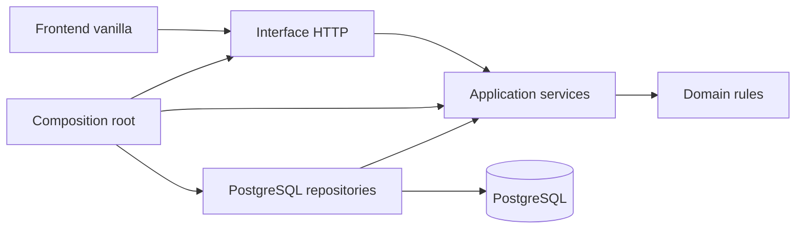

# Dokumentasi Teknis UMKM Gear - Prototipe 1

Dokumen ini menjadi panduan teknis sementara. README utama dapat dibuat terpisah sesuai format tugas.

## Teknologi

- Runtime: Node.js 20 atau lebih baru.
- Backend: Express 5.
- Database: PostgreSQL 16.
- Frontend: HTML, CSS, dan JavaScript vanilla.
- Autentikasi: JWT dalam cookie `HttpOnly`.
- Validasi request: Zod.
- Pengujian: Node.js Test Runner.

## Clean Architecture



Aturan dependensinya:

- `domain` berisi aturan bisnis murni dan tidak mengetahui Express atau PostgreSQL.
- `application` mengatur use case dan hanya menggunakan kemampuan repository yang diberikan melalui dependency injection.
- `infrastructure` mengimplementasikan penyimpanan PostgreSQL, transaksi, konfigurasi, dan JWT.
- `interfaces/http` menerjemahkan HTTP request menjadi pemanggilan use case.
- `main` merangkai seluruh dependency dan menjalankan server.
- `public` adalah frontend vanilla yang mengakses API melalui `fetch`.

## Struktur utama

```text
prototipe1/
|-- database/
|   `-- migrations/
|-- public/
|   |-- index.html
|   |-- styles.css
|   `-- app.js
|-- scripts/
|   |-- create-database.js
|   |-- migrate.js
|   `-- seed.js
|-- src/
|   |-- application/
|   |-- domain/
|   |-- infrastructure/
|   |-- interfaces/http/
|   `-- main/
|-- test/
|-- .env.example
`-- package.json
```

## Database

Database khusus aplikasi:

```text
Host     : node1 (node1-ali.masitech.net dari mesin lokal)
Port     : 5432
Database : umkm_gear_prototipe1
```

Script database memiliki pemeriksaan nama target. `DB_NAME` harus diawali `umkm_gear_` dan database sistem seperti `postgres`, `template0`, atau `template1` tidak dapat dijadikan target aplikasi.

Tabel yang dibuat:

- `users`
- `profiles`
- `categories`
- `units`
- `unit_categories`
- `loans`
- `loan_items`
- `schema_migrations`

## Menjalankan aplikasi

1. Salin `.env.example` menjadi `.env`.
2. Isi kredensial PostgreSQL dan ganti `JWT_SECRET` dengan nilai acak minimal 32 karakter.
3. Instal dependency:

   ```bash
   npm install
   ```

4. Untuk environment baru, siapkan database:

   ```bash
   npm run db:setup
   ```

5. Jalankan aplikasi:

   ```bash
   npm run dev
   ```

6. Buka `http://localhost:3000`.

Untuk database `node1`, database, migration, dan seed sudah dibuat saat prototipe disiapkan. Jangan menjalankan `db:create` menggunakan nama database lain tanpa memastikan targetnya benar.

## Akun demo

| Role | Email | Password |
|---|---|---|
| Admin | `admin@umkmgear.local` | `Admin123!` |
| Anggota | `member@umkmgear.local` | `Member123!` |
| Anggota | `budi@umkmgear.local` | `Member123!` |

Akun ini hanya untuk demonstrasi dan wajib diganti jika aplikasi digunakan di luar lingkungan latihan.

## Fitur yang sudah tersedia

### Anggota

- Login dan logout.
- Melihat ringkasan ketersediaan dan pinjaman.
- Mencari unit berdasarkan nama atau kode.
- Memilih dan meminjam satu atau dua unit.
- Memilih durasi satu sampai lima hari.
- Melihat pinjaman aktif dan riwayat sendiri.
- Melihat dan mengubah satu profil UMKM miliknya.

### Admin

- Dashboard jumlah unit, anggota, pinjaman, dan keterlambatan.
- CRUD unit, kategori, dan anggota.
- Melihat semua pinjaman aktif.
- Memproses pengembalian per unit.
- Menghitung hari terlambat dan denda otomatis.
- Melihat dan mencetak seluruh riwayat peminjaman.

## Aturan integritas penting

- Email pengguna dan kode unit unik tanpa membedakan huruf besar/kecil.
- Satu user hanya mempunyai satu profil.
- Satu unit dapat mempunyai banyak kategori.
- Satu unit hanya boleh berada pada satu peminjaman aktif.
- Maksimal dua unit aktif per anggota divalidasi di dalam transaksi database.
- Peminjaman anggota menggunakan advisory lock dan row lock untuk mencegah kondisi balapan.
- Durasi maksimal lima hari juga dilindungi oleh constraint PostgreSQL.
- Status `borrowed` hanya dapat berubah melalui proses peminjaman atau pengembalian.
- Penghapusan data utama menggunakan soft delete agar riwayat tidak rusak.
- Pengembalian menyimpan admin pemroses, kondisi akhir, jumlah hari terlambat, dan denda final.

## Endpoint utama

| Method | Endpoint | Akses | Fungsi |
|---|---|---|---|
| POST | `/api/auth/login` | Publik | Login |
| GET | `/api/auth/me` | Login | Data user aktif |
| GET | `/api/units` | Login | Katalog dan pencarian unit |
| GET/PUT | `/api/profile` | Anggota | Lihat/ubah profil |
| GET | `/api/loans/mine` | Anggota | Pinjaman milik sendiri |
| POST | `/api/loans` | Anggota | Membuat peminjaman |
| GET | `/api/admin/dashboard` | Admin | Statistik operasional |
| GET | `/api/admin/loans/active` | Admin | Semua unit yang dipinjam |
| POST | `/api/admin/loan-items/:id/return` | Admin | Memproses pengembalian |
| GET | `/api/admin/loans/history` | Admin | Riwayat untuk dicetak |
| CRUD | `/api/admin/units` | Admin | Kelola unit |
| CRUD | `/api/admin/categories` | Admin | Kelola kategori |
| CRUD | `/api/admin/members` | Admin | Kelola anggota |

## Pemeriksaan proyek

```bash
npm run check
npm test
```

`npm run check` memeriksa sintaks seluruh JavaScript. `npm test` menjalankan pengujian aturan maksimal dua unit, durasi lima hari, denda keterlambatan, dan transaksi peminjaman.
